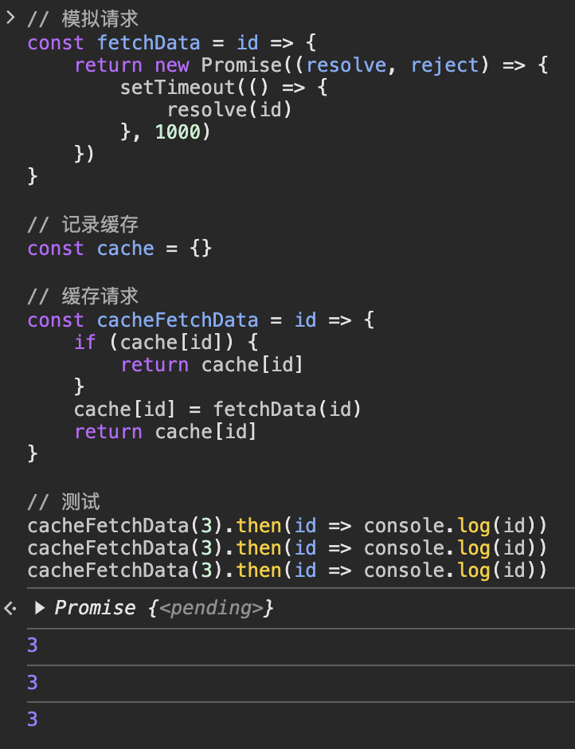

# JS

## 问题 1：阐述一下 JS 的事件循环

事件循环又叫做消息循环，是浏览器渲染主线程的工作方式。

它开启一个不会结束的 for 循环，每次循环从消息队列中取出第一个任务执行，而其他线程只需要在合适的时候将任务加入到队列末尾即可。

每个任务有不同的类型，同类型的任务必须在同一个队列，不同的任务可以属于不同的队列。不同任务队列有不同的优先级，在一次事件循环中，由浏览器自行决定取哪一个队列的任务。但浏览器必须有一个微队列，微队列的任务一定具有最高的优先级，必须优先调度执行。

## 问题 2：请说说你对函数式编程的理解

### 基本概念

函数式编程是一种编程范式，函数为一等公民，函数封装的方式解决问题

### 核心概念

#### 纯函数

无任何副作用，相同的输入（参数）得到相同的输出（返回值）

```js
const add = (a, b) => a + b
```

#### 不可变性

#### 高阶函数（也就是函数柯里化）

高阶函数特点：

- 接受一个或多个函数作为输入参数
- 输出一个函数作为返回值

```js
const add = (a) => (b) => a + b
add(1)(2)
```

#### 函数组合（类似面向对象的继承）

```js
const compose =
  (...fns) =>
  (x) =>
    fns.reduceRight((y, fn) => fn(y), x)
const double = (x) => x * 2
const square = (x) => x * x
const doubleAndSquare = compose(square, double)
console.log(doubleAndSquare(3)) // 36
```

### 优点总结

- 可测试性，更好写单元测试
- 可维护性
- 并发
- 简洁

## 问题 3：如何理解 JS 的异步？

JS 是一门单线程的语言，这是因为它运行在浏览器的渲染主线程中，而渲染主线程只有一个。

而渲染主线程承担着诸多的工作，渲染页面、执行 JS 都在其中运行。

如果使用同步的方式，就极有可能导致主线程产生阻塞，从而导致消息队列中的很多其他任务无法得到执行。这样一来，一方面会导致繁忙的主线程白白的消耗时间，另一方面导致页面无法及时更新，给用户造成卡死现象。

所以浏览器采用异步的方式来避免。具体做法是当某些任务发生时，比如计时器、网络、事件监听，主线程将任务交给其他线程去处理，自身立即结束任务的执行，转而执行后续代码。当其他线程完成时，将事先传递的回调函数包装成任务，加入到消息队列的末尾排队，等待主线程调度执行。

在这种异步模式下，浏览器永不阻塞，从而最大限度的保证了单线程的流畅运行。

## 问题 4：同一个页面三个组件请求同一个 API

思路：进行缓存

```js
// 模拟请求
const fetchData = (id) => {
  return new Promise((resolve, reject) => {
    setTimeout(() => {
      resolve(id)
    }, 1000)
  })
}

// 记录缓存
const cache = {}

// 缓存请求
const cacheFetchData = (id) => {
  if (cache[id]) {
    return cache[id]
  }
  cache[id] = fetchData(id)
  return cache[id]
}

// 测试
cacheFetchData(3).then((id) => console.log(id))
cacheFetchData(3).then((id) => console.log(id))
cacheFetchData(3).then((id) => console.log(id))
```



## 问题 5：JS 中的计时器能做到精确计时吗？为什么？

不行，因为：

1. 操作系统的计时函数本身就有少量偏差，由于 JS 的计时器最终调用的是操作系统的函数，也就携带了这些偏差
2. 受事件循环的影响，计时器的回调函数只能在主线程空闲时运行，因此又带来了偏差

## 问题 6：js 超过 Number 最大值的数怎么处理

`Number.MAX_VALUE`

### 在哪些 `场景` 会超过 Number 最大值

- 大数据计算
- 格式展示
- 用户输入

针对大数据处理

- 金融
- 科学计算
- 数据分析

### 解决方案

- BigInt

```js
const bigNum = BigInt('12312312321323313123213123132343434343434')
bigNum + bigNum
```

- Decimal.js

- big.js

- 比如在用户输入场景，需要限制输入大小

## 问题 7：window 对象上频繁绑定内容的风险

### 风险分析

- 命名冲突
- 全局污染
- 安全风险（任何人都可以修改）
- 性能问题，增加内存开销、垃圾回收的难度

### 解决方案

- 模块化
- 命名空间
- iife（形成闭包，形成独立作用域）
- 开启严格模式

## 问题 8：Symbol 数据类型

在 JavaScript 中，Symbol 是一种基本数据类型，表示独一无二的标识符。

> 它不能被隐式转换成其他类型，并且不能被直接访问。

以下是关于 Symbol 数据类型的几个关键点：

- **创建 Symbol**：

```js
let sym1 = Symbol()
let sym2 = Symbol('description')
```

- **唯一性**： 每个 Symbol 值都是唯一的，即使它们有相同的描述。

```js
let sym1 = Symbol('key')
let sym2 = Symbol('key')
console.log(sym1 === sym2) // false
```

- **作为对象属性键**： Symbol 可以用作对象属性的键，这有助于避免属性名冲突。

```js
let mySymbol = Symbol('myKey')
let obj = {}
obj[mySymbol] = 'value'
console.log(obj[mySymbol]) // "value"
```

- **全局 Symbol 注册表**： 如果需要在不同的上下文中共享同一个 Symbol，可以使用 Symbol.for 和 Symbol.keyFor 方法。

```js
let sym1 = Symbol.for('sharedKey')
let sym2 = Symbol.for('sharedKey')
console.log(sym1 === sym2) // true

let res = Symbol.keyFor(sym1)
console.log(res) // "sharedKey"
```

- **内置符号**： JavaScript 提供了一些内置的 Symbol，用于实现语言内部的功能，例如迭代器协议、异步迭代等。

> `Symbol.iterator` 是一个内置的符号，用于定义对象的默认迭代行为。当对象被用在 `for...of` 循环中时，JavaScript 引擎会查找该对象的 `Symbol.iterator` 方法，并调用它来获取一个迭代器。

```js
let obj = {
  [Symbol.iterator]() {
    let i = 0
    return {
      next: () => ({ value: i++, done: i > 3 })
    }
  }
}

for (let value of obj) {
  console.log(value) // 0, 1, 2
}
```

> 迭代器对象：迭代器是一个具有 next() 方法的对象。每次调用 next() 方法时，它应该返回一个包含 value 和 done 属性的对象：
>
> - value：当前迭代的值。
> - done：一个布尔值，表示迭代是否已经完成。

## 问题 9：以下哪段代码运行效率更高（隐藏类）

::: code-group

```js [案例1]
// 代码1（隐藏类）
const obj1 = {
  a: 1
}
const obj2 = {
  a: 1
}
const obj3 = {
  a: 1
}

// 代码2
const obj1 = {
  a: 1
}
const obj2 = {
  b: 1
}
const obj3 = {
  c: 1
}
```

```js [案例2]
// 代码1（隐藏类）
console.time('a')
for (let i = 0; i < 1000000; ++i) {
  const obj = {}
  obj['a'] = i
}
console.timeEnd('a')

// 代码2
console.time('b')
for (let i = 0; i < 1000000; ++i) {
  const obj = {}
  obj['$(i)'] = i
}
console.timeEnd('b')
```

:::

`代码1`效率更高，重用了隐藏类（Hidden Class）

> 隐藏类的特性是：多个属性顺序一致的 JS 对象，会重用同一个隐藏类，减少 new Class 的开销。

所以`案例1的代码1`生成 1 个隐藏类，而`案例1的代码2`生成 3 个隐藏类，因此`案例1的代码1`代码性能更好。

## 问题 10：以下哪段代码效率更高（数组 - 快速模式 / 字典模式）

```js
// 代码1（数组 - 快速模式）
const arr1 = []
for (let i = 0; i < 10000000; ++i) {
  arr1[i] = 1
}

// 代码2（数字 - 字典模式）
const arr2 = []
arr2[10000000 - 1] = 1
for (let i = 0; i < 10000000; ++i) {
  arr2[i] = 1
}
```

`代码1`效率更高，因为数组的快速模式。

数组模式 - 触发机制

- `快速模式`：索引从 `0` -到 `length-1`，且没有空位 或 预分配数组小于 100000，无论是否有空位。
- `字典模式`：预分配数组大于等于 100000，数组有空位。

## 问题 11：如何判断 Object 为空？

- 常用方法：

  - `Object.keys(obj).length === 0`
  - `JSON.stringify(obj) === '{}'`
  - `for in` 判断
    > 以上方法都是不太严谨，因为处理不了 `const obj = { [Symbol('a')]: 1 }` 这种情况。

- 更严谨的方法： `Reflect.ownKeys(obj).length === 0`

## 问题 12：强制类型转换、隐式类型转换

**强制类型转换：**

```js
var num = Number('42') // 强制将字符串转换为数字
var str = String(123) // 强制将数字转换为字符串
var bool = Boolean(0) // 强制将数字转换为布尔值
```

**隐式类型转换：**

```js
var result = 10 + '5' // 隐式将数字和字符串相加，结果为字符串 "105"
true == 1 // 隐式将布尔值转换为数字 1
false == 0 // 隐式将布尔值转换为数字 0
true + false // 1
true + '5' // 隐式将布尔值转换为字符串，结果为 "true5"
true + 2 // 3
'5' * '2' // 隐式将字符串转换为数字，结果为 10
undefined + 2 // NaN
```

## 问题 13：js 的数据类型有哪些？

- **基本数据类型**：

  - Number（数字）：表示数值，包括整数和浮点数。
  - String（字符串）：表示文本数据，使用引号（单引号或双引号）括起来。
  - Boolean（布尔值）：表示逻辑值，即 `true`（真）或 `false`（假）。
  - Null（空）：表示一个空值或没有值的对象。
  - Undefined（未定义）：表示一个未被赋值的变量的值。
  - Symbol（符号）：表示唯一的标识符。

- **复杂数据类型（也被称为引用类型）**：

  - Object（对象）：表示复杂数据结构，可以包含键值对的集合。
  - Array（数组）：表示有序的集合，可以包含任意类型的数据。
  - Function（函数）：表示可执行的代码块。

- **BigInt 数据类型**（在 ECMAScript 2020（ES11）规范中正式被添加）：

  - 用于对“大整数”的表示和操作。
  - 结尾用 `n` 表示：例如 `100000n / 200n`。

- **存储方式**：
  - 基础类型存放于栈，变量记录原始值。
  - 引用类型存放于堆，变量记录地址。

## 问题 14：JS 单线程设计的目的

JavaScript 是浏览器的脚本语言，主要用途是<u>进行页面的一系列交互操作以及用户互动</u>。多线程编程通常会引发<u>竞态条件、死锁和资源竞争</u>等问题。如果以多线程的方式进行浏览器操作，则可能出现不可预测的冲突。例如，假设有两个线程同时操作同一个 DOM 元素，线程 1 要求浏览器修改 DOM 内容，而线程 2 却要求删除 DOM，浏览器就会困惑，无法决定采用哪个线程的操作。

因此，JavaScript 的单线程设计很好地简化了这类并发问题，避免了因多线程而引发的竞态条件、死锁和资源竞争等问题。当然，如果在开发中确实需要处理异步场景，JavaScript 也有众多的异步队列来帮助我们实现，也就是我们熟知的事件循环、微任务队列和宏任务队列。如果真的需要开辟一个新线程处理逻辑，也可以通过 Web Worker 实现。

## 问题 15：如何判断 JS 的数据类型

- **`typeof` 操作符**：可以用来确定一个值的基本数据类型，返回一个表示数据类型的字符串。

```js
typeof 42 // "number"
typeof 'Hello' // "string"
typeof true // "boolean"
typeof undefined // "undefined"
typeof null // "object" (这是 typeof 的一个常见的误解)
typeof [1, 2, 3] // "object"
typeof { key: 'value' } // "object"
typeof function () {} // "function"
```

> 注意，typeof null 返回 "object" 是历史遗留问题，不是很准确。

- **`Object.prototype.toString`**：用于获取更详细的数据类型信息。

```js
Object.prototype.toString.call(42) // "[object Number]"
Object.prototype.toString.call('Hello') // "[object String]"
Object.prototype.toString.call(true) // "[object Boolean]"
Object.prototype.toString.call(undefined) // "[object Undefined]"
Object.prototype.toString.call(null) // "[object Null]"
Object.prototype.toString.call([1, 2, 3]) // "[object Array]"
Object.prototype.toString.call({ key: 'value' }) // "[object Object]"
Object.prototype.toString.call(function () {}) // "[object Function]"
```

- **`instanceof`** 操作符：用于检查对象是否属于某个类的实例。

```js
var obj = {}
obj instanceof Object // true

var arr = []
arr instanceof Array // true

function Person() {}
var person = new Person()
person instanceof Person // true
```

- `Array.isArray` 方法：用于检查一个对象是否是数组。

```js
Array.isArray([1, 2, 3]) // true
Array.isArray('Hello') // false
```

## 问题 16：变量提升 & 函数提升（优先级）

```js
// 以下代码输出什么结果
console.log(s);
var s = 2;
function s() {}
console.log(s);

// 会变成
function s() {}
console.log(s);
s = 2;
console.log(s);

// 答案
[Function: s]
2
```

- `var` 会变量提升。
- 优先级：函数提升 > 变量提升。

## 问题 17：null 和 undefined 的区别

**`null`**

- `null` 是一个特殊的关键字，表示一个空对象指针。
- 它通常用于显式地指示一个变量或属性的值是空的，`null` 是一个赋值的操作，用来表示 "没有值" 或 "空"。
- `null` 通常需要开发人员主动分配给变量，而不是自动分配的默认值。
- `null` 是原型链的顶层：所有对象都继承自 `Object` 原型对象，`Object` 原型对象的原型是 `null`。

```js
const a = null
console.log(a) // null

const obj = { a: 1 }
const proto = obj.__proto__
console.log(proto.__proto__) // null
```

**`undefined`**

- 当声明了一个变量但未初始化它时，它的值为 `undefined`。
- 当访问对象属性或数组元素中不存在的属性或索引时，也会返回 `undefined`。
- 当函数没有返回值时，默认返回 `undefined`。
- 如果函数的参数没有传递或没有被提供值，函数内的对应参数的值为 `undefined`。

```js
let x
console.log(x) // undefined

const obj = {}
console.log(obj.property) // undefined

function exampleFunc() {}
console.log(exampleFunc()) // undefined

function add(a, b) {
  return a + b
}
console.log(add(2)) // NaN
```

## 问题 18：什么是内存泄漏

内存泄漏是指应用程序中的内存不再被使用但仍然被占用，导致内存消耗逐渐增加，最终可能导致应用程序性能下降或崩溃。内存泄漏通常是由于开发者编写的代码未正确释放不再需要的对象或数据而导致的。

**特征**：程序对内存失去控制

**内存泄漏案例**：

- 意外的全局变量

```js
function someFunction() {
  // 这个变量会变成全局变量，并可能导致内存泄漏
  myObject = {
    /* ... */
  }
}
```

- 闭包：闭包可能会无意中持有对不再需要的变量或对象的引用，从而阻止它们被垃圾回收。

```js
function createClosure() {
  const data = [
    /* 大量数据 */
  ]
  return function () {
    // 闭包仍然持有对 'data' 的引用，即使它不再需要
    console.log(data)
  }
}

const closureFunction = createClosure()
// 当 'closureFunction' 不再需要时，它仍然保留着 'data' 的引用，导致内存泄漏。
```

- 事件监听器: 忘记移除事件监听器可能会导致内存泄漏，因为与监听器相关联的对象将无法被垃圾回收。

```js
function createListener() {
  const element = document.getElementById('someElement')
  element.addEventListener('click', () => {
    // ...
  })
}
createListener()
// 即使 'someElement' 从 DOM 中移除，该元素及其事件监听器仍将在内存中。
```

- 循环引用: 对象之间的循环引用会阻止它们被垃圾回收。

```js
function createCircularReferences() {
  const obj1 = {}
  const obj2 = {}
  obj1.ref = obj2
  obj2.ref = obj1
}
createCircularReferences()
// 由于循环引用，'obj1' 和 'obj2' 都将保留在内存中。
```

- setTimeout/setInterval: 使用 setTimeout 或 setInterval 时，如果没有正确清理，可能会导致内存泄漏，特别是当回调函数持有对大型对象的引用时。

```js
function doSomethingRepeatedly() {
  const data = [
    /* 大量数据 */
  ]
  setInterval(() => {
    // 回调函数持有对 'data' 的引用，即使它不再需要
    console.log(data)
  }, 1000)
}
doSomethingRepeatedly()
// 'doSomethingRepeatedly' 不再使用时，定时器仍然运行，导致内存泄漏。
```

## 问题 19：什么是闭包，有什么作用

**定义**：<u style="background: pink;">闭包是</u>指引用了另一个函数作用域中变量的<u style="background: pink;">函数</u>，通常是在嵌套函数中实现的。

**作用**：闭包可以保留其被定义时的作用域，这意味着闭包内部可以访问外部函数的局部变量，即使外部函数已经执行完毕。这种特性使得闭包可以在后续调用中使用这些变量。

**注意**：闭包会使得函数内部的变量在函数执行后仍然存在于内存中，直到没有任何引用指向闭包。如果不注意管理闭包，可能会导致内存泄漏问题。

**案例**：

```js
// 案例1
const accumulation = function (initial) {
  let result = initial
  return function (value) {
    result += value
    return result
  }
}

// 案例2
for (var i = 0; i < 10; ++i) {
  ;(function (index) {
    setTimeout(function () {
      console.log(index)
    }, 1000)
  })(i)
}
```

## 问题 20：数组去重的方法

- Set：只允许存储唯一的值，可以将数组转换为 `Set`，然后再将 `Set` 转换回数组以去重。

```js
const arr = [1, 2, 2, 3, 4, 4, 5]
const uniqueArr = [...new Set(arr)]
```

- 利用 filter 方法: 遍历数组，只保留第一次出现的元素。

```js
const arr = [1, 2, 2, 3, 4, 4, 5]
const uniqueArr = arr.filter(
  (value, index, self) => self.indexOf(value) === index
)
```

- 使用 reduce 方法: 逐个遍历数组元素，构建一个新的数组，只添加第一次出现的元素。

```js
const arr = [1, 2, 2, 3, 4, 4, 5]
const uniqueArr = arr.reduce((acc, current) => {
  if (!acc.includes(current)) {
    acc.push(current)
  }
  return acc
}, [])
```

- 使用 indexOf 方法: 遍历数组，对于每个元素，检查其在数组中的索引，如果第一次出现，则添加到新数组。

```js
const arr = [1, 2, 2, 3, 4, 4, 5]
const uniqueArr = []
arr.forEach((value) => {
  if (uniqueArr.indexOf(value) === -1) {
    uniqueArr.push(value)
  }
})
```

- 使用 includes 方法: 类似于 indexOf 方法，只不过使用 includes 来检查元素是否已存在于新数组。

```js
const arr = [1, 2, 2, 3, 4, 4, 5]
const uniqueArr = []
arr.forEach((value) => {
  if (!uniqueArr.includes(value)) {
    uniqueArr.push(value)
  }
})
```

## 问题 21：JS 数组 reduce 方法的使用

```js
// 累加
const result = [1, 2, 3].reduce((pre, cur) => pre + cur)
console.log(result)

// 找最大值
const result = [1, 2, 3, 2, 1].reduce((pre, cur) => Math.max(pre, cur))
console.log(result)

// 数组去重
const resultList = [1, 2, 3, 2, 1].reduce((preList, cur) => {
  if (preList.indexOf(cur) === -1) {
    preList.push(cur)
  }
  return preList
}, [])
console.log(resultList)

// 归类
const dataList = [
  { name: 'aa', country: 'China' },
  { name: 'bb', country: 'China' },
  { name: 'cc', country: 'USA' },
  { name: 'dd', country: 'EN' }
]
const resultObj = dataList.reduce((preObj, cur) => {
  const { country } = cur
  if (!preObj[country]) {
    preObj[country] = []
  }
  preObj[country].push(cur)
  return preObj
}, {})
console.log(resultObj)

// 字符串反转
const str = 'hello world'
const resultStr = Array.from(str).reduce((pre, cur) => {
  return `${cur}${pre}`
}, '')
console.log(resultStr)
```

## 问题 22：JS 数组常见操作方式及方法

```js
// 遍历
for (let i = 0; i < list.length; ++i) {} // 遍历性能最好
for (const key in list) {
}
for (const item of list) {
}
list.forEach((item) => {}) // 仅遍历
list.map((item) => {}) // 返回构造后的新数组

// 逻辑判断
list.every((item) => {}) // 全部返回 true 则函数返回 true
list.some((item) => {}) // 有一项返回 true, 则函数返回 true, 内部 或 关系

// 过滤
list.filter((item) => {}) // 返回过滤后的新数组

// 查找
list.indexOf() // 第一个找到的位置，否则为 -1
list.lastIndexOf() // 最后一个找到的位置，否则为 -1
list.includes() // 接受一个参数，如果数组有目标值，则返回 true
list.find() // 如果找到目标值，返回目标值，否则返回 undefined
list.findIndex() // 如果找到目标值，返回下标，否则返回 -1
```

## 问题 23：如何遍历对象

```js
// for in
const obj = { a: 1, b: 2, c: 3 }
for (let key in obj) {
  console.log(key, obj[key])
}

// Object.keys
const obj = { a: 1, b: 2, c: 3 }
const keys = Object.keys(obj)
keys.forEach((key) => {
  console.log(key, obj[key])
})

// Object.entries
const obj = { a: 1, b: 2, c: 3 }
const entries = Object.entries(obj)
entries.forEach(([key, value]) => {
  console.log(key, value)
})

// Reflect.ownKeys
const obj = { a: 1, b: 2, c: 3 }
Reflect.ownKeys(obj).forEach((key) => {
  console.log(key, obj[key])
})
```

## 问题 24：创建对象的方式

- 对象字面量：使用大括号 `{}` 创建对象，可以在大括号内定义对象的属性和方法。

```js
var person = {
  name: 'Alice',
  age: 30,
  sayHello: function () {
    console.log('Hello!')
  }
}
```

- 构造函数（Constructor Function）：使用构造函数创建对象，通过 new 关键字调用以创建对象。

```js
function Person(name, age) {
  this.name = name
  this.age = age
}

var person1 = new Person('Alice', 30)
```

- Object.create() 方法：使用 Object.create() 方法创建对象，可以指定对象的原型。

```js
var person = Object.create(null) // 创建一个空对象
person.name = 'Alice'
person.age = 30
```

- 类（ES6 中引入的类）：使用类定义对象，类是一种对象构造器的语法糖。

```js
class Person {
  constructor(name, age) {
    this.name = name
    this.age = age
  }
}

var person1 = new Person('Alice', 30)
```

## 问题 25：什么是作用域链

作用域链是 JavaScript 中用于查找变量的一种机制，它是由一系列嵌套的作用域对象构成的链式结构。每个作用域对象包含了在该作用域中声明的变量以及对外部作用域的引用，目的是确定在给定的执行上下文中如何查找变量。当您引用一个变量时，JavaScript 引擎会首先在当前作用域对象中查找该变量。如果找不到，它会沿着作用域链向上查找，直到找到该变量或达到全局作用域。如果变量在全局作用域中也找不到，将抛出一个引用错误。

**作用域链的形成方法**：

1. 在函数内部，会创建一个新的作用域对象，包含了函数的参数、局部变量以及对外部作用域的引用。
2. 如果在函数内部嵌套了其他函数，那么每个内部函数都会创建自己的作用域对象，形成一个链。
3. 这个链条会一直延伸到全局作用域。

## 问题 26：作用域链如何延长

**闭包**

闭包可以延长作用域链，使得函数内部的变量在函数执行完毕后仍然可以被访问。

```js
function makeCounter() {
  var count = 0
  return function () {
    count++
    return count
  }
}

var counter1 = makeCounter()
var counter2 = makeCounter()

console.log(counter1()) // 1
console.log(counter1()) // 2
console.log(counter2()) // 1，每个 counter 具有自己的作用域链，且都延长了 count 的作用域
```
