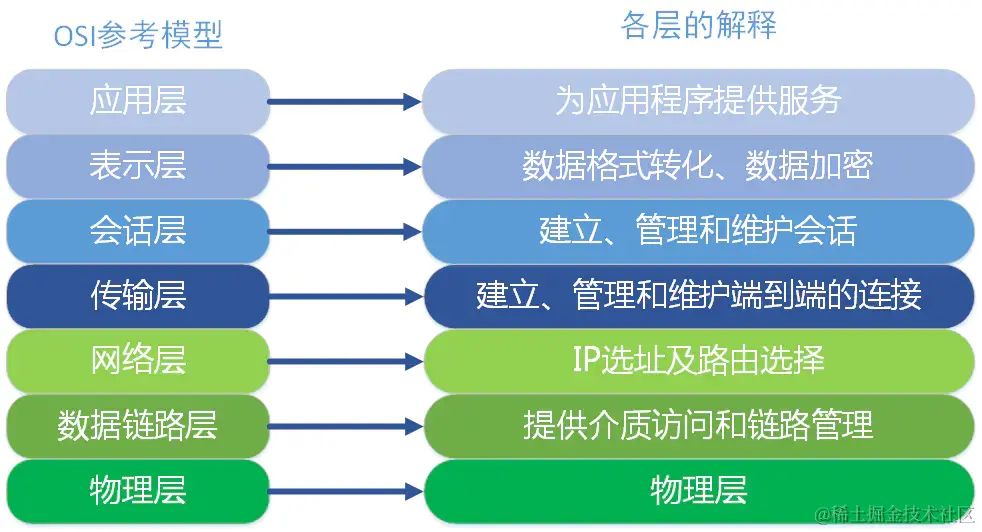
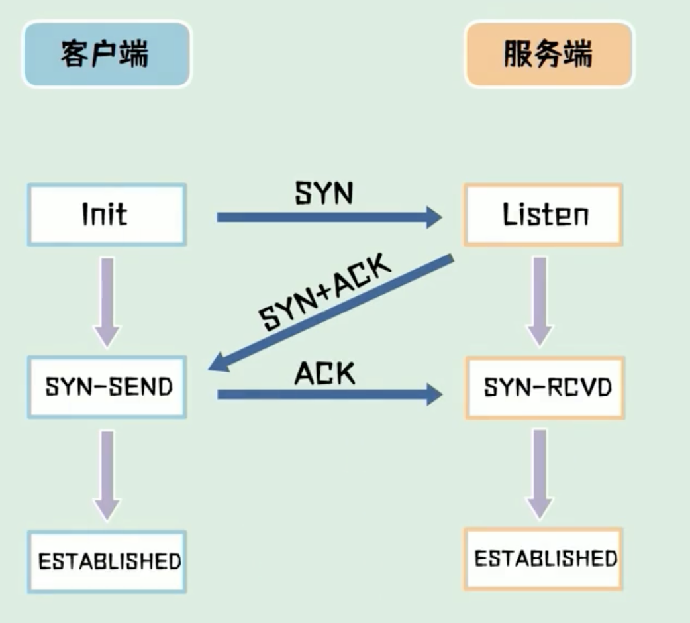
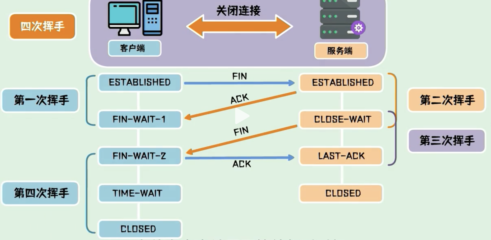
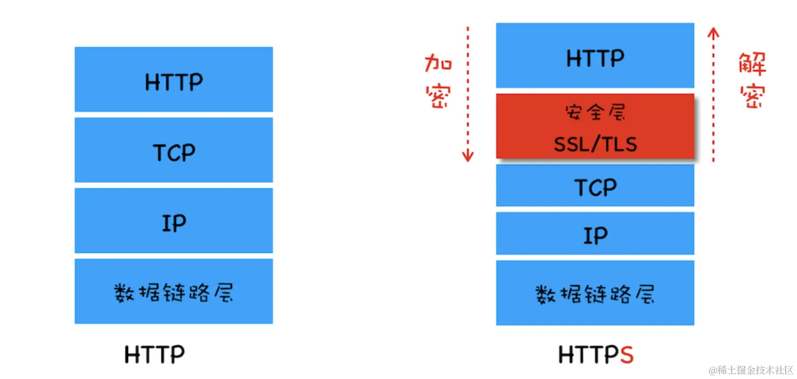

# 计算机网络

::: details 目录

[[toc]]

:::

## 面试题 1：OSI 及 OSI 七层模型

作用：将世界范围内的计算机连接为网络的框架

### OSI 七层模型

1. 应用层
   - 直接为用户提供网络服务，如 HTTP、FTP、SMTP 等。
   - 是用户与网络之间的接口，提供各种高级服务。
2. 表示层
   - 负责数据格式转换、加密解密、压缩解压等。
   - 确保发送方和接收方能够理解彼此的数据格式。
3. 会话层
   - 负责建立、管理和终止应用程序之间的会话。
   - 协调通信控制，例如对话的发起和结束。
4. 传输层
   - 不同主机之间的通信，提供端到端的通信服务，确保数据完整无误地到达接收方（稳定性）。
   - 常见协议有 TCP（传输控制协议）和 UDP（用户数据报协议）。
5. 网络层（IP 层面）
   - 负责路由选择，即将数据包从源地址传输到目的地址。
   - 处理数据包的转发和路径选择。
6. 数据链路层
   - 提供节点到节点的数据传输，检测并可能纠正错误。
7. 物理层
   - 描述数据在物理设备上如何传输和编码。

## 面试题 2：TCP/IP

定义：TCP（传输层）/IP（网络层） 是一组协议，用于在不同网络中实现传输数据的规范。它由两个主要部分组成：TCP（传输控制协议）和 IP（因特网协议）。

### TCP/IP 模型

和 OSI 模型类似，TCP/IP 模型分为 `4层`。

1. 应用层：将 OSI 的应用层、表示层、会话层进行整合。
2. 传输层
3. 网络层
4. 网络接口层：对应 OSI 的物理层、数据链路层

## 面试题 3：TCP（传输控制协议） 和 UDP（用户数据报协议） 的区别

两种常用的传输层协议，用于在网络中传输数据。

1. 连接方式
   - TCP：面向连接的协议，在传输数据之前需要建立可靠的连接（三次握手），确保通信双方准备好。
   - UDP：无连接的协议，直接发送数据，不需建立连接。
2. 可靠性
   - TCP：传输数据时，会进行错误校验和重传机制，确保数据传输成功。
   - UDP：不可靠的传输，不保证数据一定能到达接收方，也不保证数据顺序。
3. 速度
   - TCP：由于有连接建立、确认和重传等过程，速度较慢。
   - UDP：没有这些额外的操作，速度快，适合对实时性要求较高的场景。

## 面试题 4：TCP 的三次握手和四次挥手

### 三次握手

三次握手用于**建立连接**，建立连接的过程发送了 3 次数据包，也称为“三次握手”。

1. SYN 包：客户端先发一次请求，询问服务器能否建立连接
2. SYN+ACK 包：服务器收到请求后，向客户端发送确认包
3. ACK 包：客户端收到服务器的 ACK 包，表示服务器已经收到请求，可以建立连接

### 为什么是三次而不是两次？

因为为了防止已失效的请求报文，突然又传到服务器引起错误。就是为了解决网络信道不可靠的问题。

比如：SYN1 包在传输过程中，因为网络问题没有到达服务器，客户端重新发送 SYN2 包，这时服务器接收到 SYN2 后，返回 SYN+ACK 包，与客户端建立连接，这时如果 SYN1 网络好了，到达了服务器，服务器会认为这个失效的 SYN1 包是客户端发起的第二次连接，又会返回一个 SYN+ACK 包，导致两次状态不一致。

### 四次挥手

四次挥手用于**断开连接**，断开连接的过程发送了 4 次数据包，也称为“四次挥手”。

1. FIN 包：客户端发一个 FIN 包，表示要断开连接，但连接还保持，客户端进入终止等待 1 状态
2. ACK 包：服务器收到 FIN 包，返回一个 ACK 包，表示自己已经收到 FIN 包，自己进入关闭等待状态，客户端进入终止等待 2 状态
3. FIN 包：服务器发一个 FIN 包，表示要断开连接，但连接还保持
4. ACK 包：客户端收到 FIN 包，返回一个 ACK 包，客户端进入超时等待状态，经过超时时间后关闭连接，而服务器收到最后一次 ACK 包后立刻关闭连接。

### 为什么四次挥手，最后客户端需要进入超时等待状态？

这是为了保证服务器能够正常收到最后一个 ACK 包，防止客户端提前关闭连接。

## 面试题 5：HTTP 请求方式

1. GET：用于获取资源，通过 URL 传递参数，请求的结果会被缓存，可以被书签保存，不适合传输敏感信息。
2. POST：用于提交数据，将数据放在请求体中发送给服务器，请求的结果不会被缓存。
3. PUT：用于更新资源，将数据放在请求体中发送给服务器，通常用于更新整个资源。
4. DELETE：用于删除资源，将数据放在请求体中发送给服务器，用于删除指定的资源。
5. PATCH：用于部分更新资源，将数据放在请求体中发送给服务器，通常用于更新资源的部分属性。

## 面试题 6：GET 和 POST 的区别

**区别：**

1. get 幂等，post 不是。（多次访问效果一样为幂等）
2. get 能触发浏览器缓存，post 没有。
3. get 能由浏览器自动发起（如 img - src，资源加载），post 不行。
4. post 相对安全，一定程度上规避 CSRF 风险。

**相同：**

1. 都不安全，都是基于 http，明文传输（要做到安全，需要做加密，例如：https）。
2. 参数并没有大小限制，是 URL 大小有限制，因为要保护服务器。

> 因为 GET 请求的参数是在 URL 中的，而 URL 有大小的限制

## 面试题 7：RESTful 规范

**使用语义化的 URL 来表示资源的层级关系和操作**，如/users 表示用户资源，/users/{id}表示具体的用户。

1. 资源：将系统中的实体抽象为资源，每个资源都有一个唯一的标识符（URI）。
2. HTTP 方法：使用 HTTP 请求方式来操作资源，如 GET、POST、PUT、DELETE 等。
3. 状态码：使用 HTTP 状态码来表示请求的结果，如 200 表示成功，404 表示资源不存在等。
4. 无状态：每个请求都是独立的，服务器不保存客户端的状态信息，客户端需要在请求中携带所有必要的信息。

## 面试题 8：常见的 HTTP 状态码以及代表的意义

- 200 OK：请求成功，服务器成功处理了请求。
- 201 Created：请求已成功，并在服务器上创建了新的资源。
- 204 No Content：服务器成功处理了请求，但没有返回任何内容。
- 301 Moved Permanently：**永久重定向**，请求的资源已永久移动到新位置，客户端需要更新其请求地址。
- 302 Found：**临时重定向**，请求的资源已临时移动到新位置，但未来请求仍使用原始 URl。
- 303 See Other：请求的资源已临时移动到新位置，类似于 302，但明确要求客户端使用 GET 方法访问新的 URL。
- 304 Not Modified：请求的资源未修改，服务器返回此状态码，客户端可以使用缓存的资源。
- 400 Bad Request：服务器无法理解请求的语法，请求有语法错误。
- 401 Unauthorized：请求需要用户身份验证。
- 403 Forbidden：服务器拒绝请求，没有权限访问。
- 404 Not Found：请求的资源不存在。
- 405 Method Not Allowed：请求方法不被允许。
- 500 Internal Server Error：服务器内部错误，无法完成请求。
- 502 Bad Gateway：服务器作为网关或代理，从上游服务器收到无效响应。
- 503 Service Unavailable：服务器当前无法处理请求，通常由于过载或维护。

## 面试题 9：什么是 HTTPS 协议？如何加密的？

超文本传输安全协议 HTTPS 在 HTTP 层和 tcp 层中间加了一个 SSL/TLS 安全层，进行加密，避免了 HTTP 协议存在的信息窃听，信息劫持等风险。

HTTPS 增加的 TLS/SSL 层可以**对身份进行验证、信息加密解密**功能，避免这种问题发生。安全层的主要职责就是对发起的 HTTP 的数据进行加密解密操作。

## 面试题 10：Http 和 Https 的区别？

主要的区别在于**安全性和数据传输方式**上，HTTPS 比 HTTP 更加安全，适合用于保护网站用户的隐私和安全，如银行网站、电子商务网站等。

- **安全性**：HTTP 协议传输的数据都是未加密的，也就是明文的，因此使用 HTTP 协议传输的数据可以被任何抓包工具截取并查看。而 HTTPS 协议是由 SSL+HTTP 协议构建的可进行加密传输、身份认证的网络协议，更为安全。
- **端口号**：HTTP 协议的端口号是 80，HTTPS 协议的端口号是 443。
- **网址导航栏显示**：使用 HTTP 协议的网站导航栏显示的是"http://"，而使用 HTTPS 协议的网站导航栏显示的是"https://"。
- **网络速度**：HTTP 协议比 HTTPS 协议快，因为 HTTPS 协议需要进行加密和解密的过程。
- **SEO 优化**：搜索引擎更倾向于把 HTTPS 网站排在更前面的位置，因为 HTTPS 更安全。

## 面试题 11：Http1 和 Http2 的区别？

## 面试题 12：Cookie 为了解决什么问题？

## 面试题 13：Cookie 和 Session 的区别？
